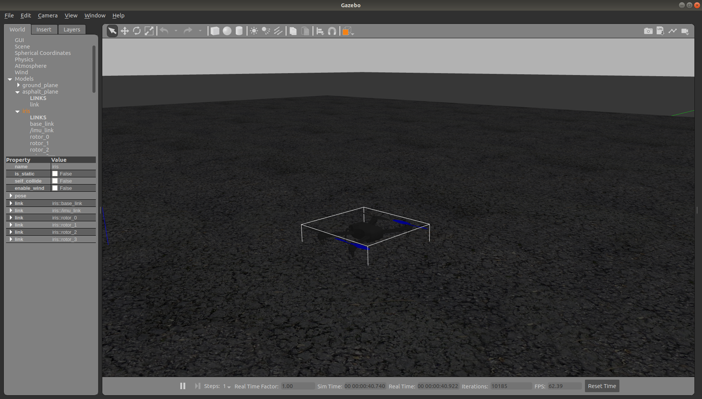
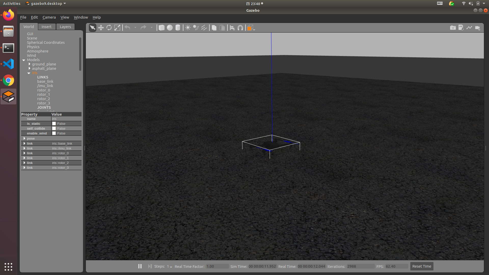
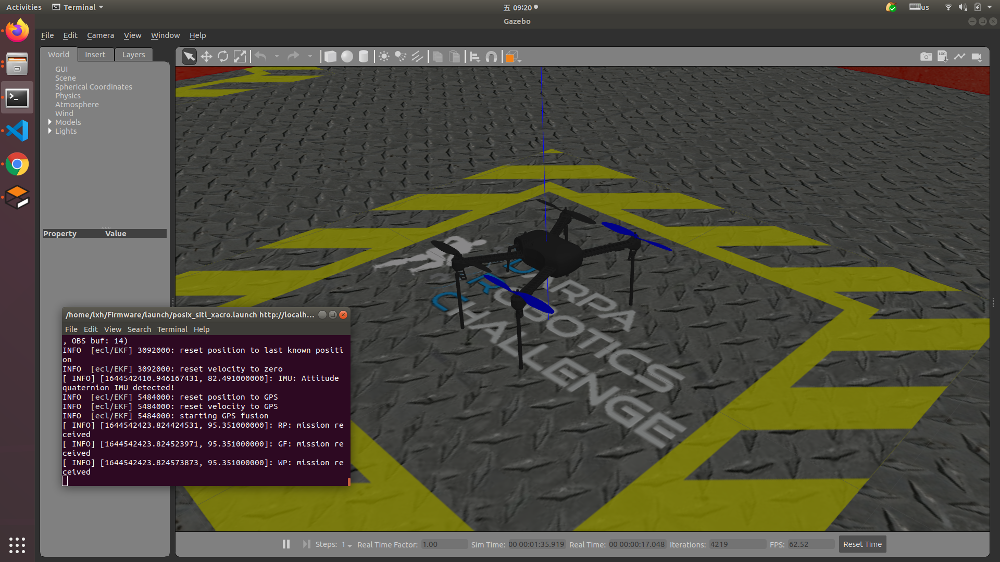
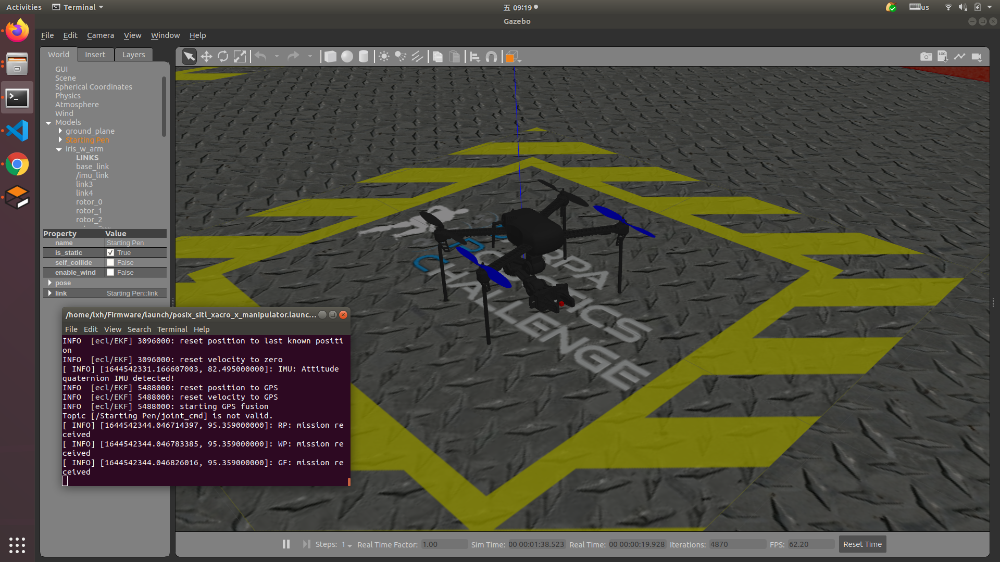

# 仿真环境配置

## 开始之前

本期介绍仿真环境的配置，介绍项目需要的各种工具（包括ROS，仿真工具，PX4，QGC等）的安装和配置过程以及飞行机械臂模型（搭载机械臂模型的多旋翼无人机）的搭建，关于机械臂的具体建模、机械臂跟踪的实现及机械臂抓取的实现不在本期讨论。

开始之前请先克隆本仓库：

```Shell
cd ~/ # 切换到目标目录，这里以家目录为例，下同
git clone https://github.com/amazerobot/AerialManipulator.git
```

## 搭建仿真环境

### 安装ROS，配置工作空间

本项目的所有代码均在ROS Melodic版本下测试通过。ROS安装过程请参考[ROS文档](http://wiki.ros.org/melodic/Installation/Ubuntu)，简单起见，我们选择`Desktop-Full Install`配置安装。

安装完成后还需配置工作空间，配置过程亦请参考[ROS文档](http://wiki.ros.org/ROS/Tutorials/InstallingandConfiguringROSEnvironment)，使用catkin[创建工作空间](http://wiki.ros.org/ROS/Tutorials/InstallingandConfiguringROSEnvironment#Create_a_ROS_Workspace)：

```Shell
cd ~/ # 切换到目标目录，这里以家目录为例，下同
mkdir -p ~/catkin_ws/src
cd ~/catkin_ws/
catkin_make
source devel/setup.bash # 每次catkin_make之后都执行此行刷新环境变量
```

### 安装gazebo插件

请先确认gazebo可以正常工作，可能需要修改位于`~/.ignition/fuel/`目录下的`config.yaml`文件，除此之外，还需要保证`~/.gazebo/models`目录及其中的模型文件存在。

安装gazebo插件：

```Shell
sudo apt install ros-melodic-gazebo-*
```

### 安装[mavros](http://wiki.ros.org/mavros)

```Shell
sudo apt install ros-melodic-mavros ros-melodic-mavros-extras
cd ~/AerialManipulator # 切换到AerialManipulator目录中，下同
wget https://raw.githubusercontent.com/mavlink/mavros/master/mavros/scripts/install_geographiclib_datasets.sh 
chmod +x install_geographiclib_datasets.sh
sudo ./install_geographiclib_datasets.sh
```

### 下载编译PX4固件

从本节至[环境配置的最后部分](###配置PX4&ROS环境)整合了PX4开发文档中[Toolchain Installation](https://docs.px4.io/master/en/dev_setup/dev_env_linux_ubuntu.html)和[Building the Code](https://docs.px4.io/master/en/dev_setup/building_px4.html)等部分，如有疑问可先阅读[PX4文档](https://docs.px4.io/master/en/development/development.html)。

下载并安装工具链：

```Shell
cd ~/AerialManipulator
wget https://raw.githubusercontent.com/PX4/Firmware/master/Tools/setup/ubuntu.sh
wget https://raw.githubusercontent.com/PX4/Firmware/master/Tools/setup/requirements.txt
```

本项目无需使用[nuttx](https://nuttx.apache.org/)，执行`ubuntu.sh`时可加上`--no-nuttx`字段或直接修改`ubuntu.sh`第16行为`INSTALL_NUTTX="false"`：

```Shell
sudo apt install python-pip
source ubuntu.sh --no-nuttx # 无需修改脚本
```

下载编译PX4 Firmware：

```Shell
cd ~/ # 切换到目标目录，这里以家目录为例子，下同
git clone https://github.com/PX4/Firmware
cd Firmware
git submodule update --init --recursive # 更新submodule
git checkout v1.11.0 # 切换固件版本
make distclean
make px4_sitl_default gazebo
```

编译启动gazebo，效果如下：



### 下载安装[QGC地面站](https://qgc.dev/)

直接[下载AppImage文件](https://github.com/mavlink/qgroundcontrol/releases/tag/v3.5.6)即可，注意Ubuntu 18.04并不支持QGC >= 4.0，请勿安装过高版本的QGC。

下载完成后执行：

```Shell
sudo usermod -a -G dialout $USER
sudo apt-get remove modemmanager -y
sudo apt install gstreamer1.0-plugins-bad gstreamer1.0-libav gstreamer1.0-gl -y
```
启动QGC，效果如图：

```Shell
cd ~/Download/ # 切换到目标目录，这里以Download目录为例
chmod +x ./QGroundControl.AppImage
./QGroundControl.AppImage
```


### 配置PX4&ROS环境

请先确认`.bashrc`中有如下两行：

```Shell
source /opt/ros/melodic/setup.bash
source ~/catkin_ws/devel/setup.bash
```

并在`.bashrc`中添加如下几行：

```Shell
source ~/Firmware/Tools/setup_gazebo.bash ~/Firmware/ ~/Firmware/build/px4_sitl_default
export ROS_PACKAGE_PATH=$ROS_PACKAGE_PATH:~/Firmware
export ROS_PACKAGE_PATH=$ROS_PACKAGE_PATH:~/Firmware/Tools/sitl_gazebo
```

测试启动PX4仿真：

```
cd ~/Firmware
roslaunch px4 posix_sitl.launch
```

此时应当启动gazebo环境并在仿真环境中出现iris飞机模型，效果如下：



## 2. 搭建飞行机械臂模型

将[mobot_urdf](../mobot_urdf/)目录复制到ROS工作空间中：

```Shell
cd ~/AerialManipulator
cp -r mobot_urdf ~/catkin_ws/src # 将mobot_urdf放在ros工作空间的src下
cd ~/catkin_ws/
catkin_make
```

将mobot_urdf/launch中的文件复制到Firmware/launch中：

```Shell
cp ~/AerialManipulator/mobot_urdf/launch/* ~/Firmware/launch
```

在Firmware目录下执行，查看修改后的模型，效果如图：

``` Shell
cd ~/Firmware
roslaunch px4 posix_sitl_xacro.launch # 启动带有四个高脚架的iris无人机
roslaunch px4 posix_sitl_xacro_x_manipulator.launch # 启动带有高脚架和机械臂的iris无人机
```





同时可以用地面站控制无人机，如下图：


## 写在最后

至此本项目的仿真环境搭建完成，下期介绍使用moveit配置机械臂模型并实现运动控制。

执行上述过程中遇到的任何问题可提交issue讨论。部分常见问题会包含在视频教程中供大家参考。