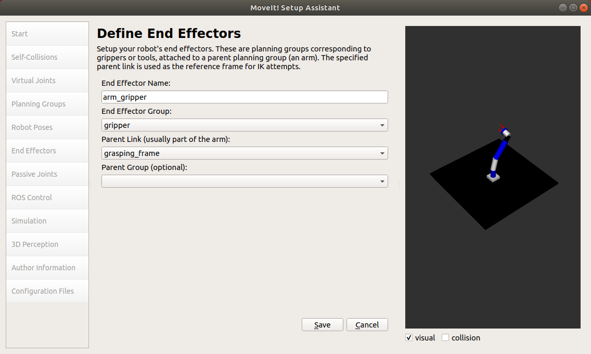
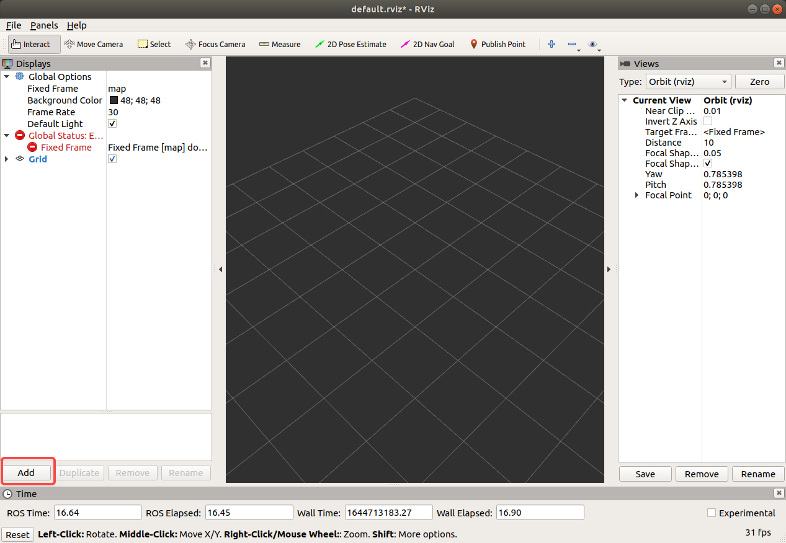

# 机械臂建模与机械臂运动控制

## 开始之前

本期介绍使用moveit配置机械臂模型以及使用rviz和gazebo实现机械臂运动控制和仿真的过程。

开始之前，请先安装moveit：

```Shell
# 确认安装的ros为最新版本
rosdep update
sudo apt-get update
sudo apt-get dist-upgrade

# 确认catkin已安装
sudo apt-get install ros-melodic-catkin python-catkin-tools

#　安装moveit
sudo apt install ros-melodic-moveit
```

[这里](http://docs.ros.org/en/melodic/api/moveit_tutorials/html/doc/getting_started/getting_started.html)是moveit的官方教程，若对上述过程有疑惑请先参考官方文档，同时，官方文档提供了示例代码与测试说明，如有需要请自行下载编译测试。

本仓库包含完整的配置文件，可以直接跳转至[机械臂仿真与控制](＃机械臂仿真与控制)小结将相关文件复制至工作空间中编译运行即可。

本文档从[配置机械臂模型](#配置机械臂模型)小结开始介绍使用moveit配置机械臂的过程。如果你不熟悉这一过程，我们强烈建议跟随本文档完成一遍配置，在进行配置之前，需要先屏蔽仓库中已有的配置文件，我们提供了一个名为`phase2_self_config`的git tag以方便操作，如下：

```Shell
# 我们为每一期内容添加了一个tag，可以使用以下指令查看所有tag
# git tag

cd ~/AerialManipulator
git checkout phase2_self_config # 删除了第二期中已配置好的文件

# 切换回main branch可以使用以下指令
# git checkout main
```

## 配置机械臂模型

### 启动moveit

执行：

```Shell
roslaunch moveit_setup_assistant setup_assistant.launch
```

若moveit正常安装，即可启动moveit：              


### 配置机械臂模型

#### 载入机械臂模型

如下图，创建新的moveit configuration package，选择[arm.xacro](../mobot_urdf/urdf/arm.xacro)（路径为`<path_to_mobot_urdf>/urdf/arm.xacro`），点击加载文件（Load Files）即可载入机械臂模型：


模型文件加载完成后，可以看到moveit的配置界面，本文档以下内容与此界面左侧选项对应，未说明的部分不需操作可直接跳过：


此时的机械臂模型是静态模型，通过以下配置配置完成机械臂运动控制仿真。

#### 生成碰撞矩阵

点击`Self-Collision`生成碰撞矩阵。

不需调整参数，直接生成碰撞矩阵即可：


#### 创建规划组

点击`Planning Groups`创建规划组，依次创建机械臂连杆（arm）和抓手（gripper）两个规划组：


点击`Add Group`按钮新建arm规划组，选择kdl为动力学求解器：


点击`Add Kin. Chain`为机械臂连杆添加铰链，选择`Base Link`为`base_link`，`Tip Link`为`link6`：

 

用同样的方式创建gripper规划组，机械臂末端抓手不涉及运动规划，动力学求解器设置为`None`：


点击`Add Joints`为机械臂末端抓手添加关节，将`finger_joint1`和`finger_joint2`添加到`Selected Joints`中:


#### 定义机械臂姿态

点击`Robot Poses`定义机械臂姿态。

点击`Add Pose`为机械臂添加姿态，如下图定义各关节位置参数均为0值生成`init`姿态：


通过设置各关节的不同位置定义机械臂的姿态，这里定义了三个姿态，分别为`init`，`p1`和`p2`：


#### 添加末端执行器

点击`End Effectors`定义末端执行器。

分别指定`End Effector Name`，`End Effector Group`和`Parent Link`即可：



#### 生成urdf模型文件

点击`Simulation`生成urdf模型文件。

moveit可以生成配置好的机械臂的模型文件：


#### 填写作者信息

点击`Author Information`填写作者信息。

注意请不要跳过此步，否则无法正确生成配置文件。

#### 生成机械臂配置文件

点击`Configuration Files`生成配置文件，注意配置文件保存的路径。


## 修改配置文件

由moveit直接生成的配置文件无法直接为ROS所用，完成如上操作后，还需修改部分配置文件的内容，以下给出需要修改的文件的地址以及文件内容，将正确的文件复制替换直接生成的文件即可，但同时建议查看文件内容。

注意上一期文档中我们默认你将本项目仓库克隆至用户家目录下，ROS工作空间位于当前用户家目录下。方便起见我们保持此假设，moveit配置目录相应地位于`~/catkin_ws/src/marm_moveit_config`。

### ros_controllers.yaml

```Shell
cd ~/catkin_ws/src/marm_moveit_config/config # 注意文件路径
gedit ros_controllers.yaml # 使用你习惯的编辑器，这里以gedit为例，下同
```

将文件内容改为：

```yaml
controller_manager_ns: controller_manager
controller_list:
  - name: arm/arm_joint_controller
    action_ns: follow_joint_trajectory
    type: FollowJointTrajectory
    default: true
    joints:
      - joint1
      - joint2
      - joint3
      - joint4
      - joint5
      - joint6

  - name: arm/gripper_controller
    action_ns: follow_joint_trajectory
    type: FollowJointTrajectory
    default: true
    joints:
      - finger_joint1
      - finger_joint2
```

### moveit_planning_execution.launch

```Shell
cd ~/catkin_ws/src/marm_moveit_config/launch # 注意文件路径
gedit moveit_planning_execution.launch
```

将文件内容改为：

```xml
<launch>
 # The planning and execution components of MoveIt! configured to 
 # publish the current configuration of the robot (simulated or real)
 # and the current state of the world as seen by the planner
 <include file="$(find marm_moveit_config)/launch/move_group.launch">
  <arg name="publish_monitored_planning_scene" value="true" />
 </include>
 # The visualization component of MoveIt!
 <include file="$(find marm_moveit_config)/launch/moveit_rviz.launch"/>

  <!-- We do not have a robot connected, so publish fake joint states -->
  <node name="joint_state_publisher" pkg="joint_state_publisher" type="joint_state_publisher">
    <param name="/use_gui" value="false"/> 
    <rosparam param="/source_list">[/arm/joint_states]</rosparam>
  </node>

</launch>
```

## 编写启动文件

### marm_trajectory_control.yaml & arm_gazebo_joint_states.yaml

在编写启动文件之前，还需要创建两个必要的配置文件。

```Shell
# 创建marm_trajectory_control.yaml
cd ~/catkin_ws/src/mobot_urdf/config
gedit marm_trajectory_control.yaml
```

文件内容为：

```yaml
arm:
  arm_joint_controller:
    type: "position_controllers/JointTrajectoryController"
    joints:
      - joint1
      - joint2
      - joint3
      - joint4
      - joint5
      - joint6

    gains:
      joint1:   {p: 1000.0, i: 0.0, d: 0.1, i_clamp: 0.0}
      joint2:   {p: 1000.0, i: 0.0, d: 0.1, i_clamp: 0.0}
      joint3:   {p: 1000.0, i: 0.0, d: 0.1, i_clamp: 0.0}
      joint4:   {p: 1000.0, i: 0.0, d: 0.1, i_clamp: 0.0}
      joint5:   {p: 1000.0, i: 0.0, d: 0.1, i_clamp: 0.0}
      joint6:   {p: 1000.0, i: 0.0, d: 0.1, i_clamp: 0.0}


  gripper_controller:
    type: "position_controllers/JointTrajectoryController"
    joints:
      - finger_joint1
    gains:
      finger_joint1:  {p: 50.0, d: 1.0, i: 0.01, i_clamp: 1.0}
```

```Shell
# 创建arm_gazebo_joint_states.yaml
cd ~/catkin_ws/src/mobot_urdf/config
gedit arm_gazebo_joint_states.yaml
```

```yaml
arm:
  # Publish all joint states -----------------------------------
  joint_state_controller:
    type: joint_state_controller/JointStateController
    publish_rate: 250  
```

注意若在其他目录下创建这两个文件，需要修改相关launch文件（如`marm_gazebo_states.launch`）中的加载路径。

### marm_gazebo_states.launch & marm.launch

编写启动文件。

```Shell
# marm_gazebo_states.launch
cd ~/catkin_ws/src/mobot_urdf/launch
gedit marm_gazebo_states.launch
```

文件内容为：

```xml
<launch>
    <!-- 将关节控制器的配置参数加载到参数服务器中 -->
    <rosparam file="$(find mobot_urdf)/config/arm_gazebo_joint_states.yaml" command="load"/>

    <node name="joint_controller_spawner" pkg="controller_manager" type="spawner" respawn="false"
          output="screen" ns="/arm" args="joint_state_controller" />

    <!-- 运行robot_state_publisher节点，发布tf -->
    <node name="robot_state_publisher" pkg="robot_state_publisher" type="robot_state_publisher"
        respawn="false" output="screen">
        <remap from="/joint_states" to="/arm/joint_states" />
    </node>


    <rosparam file="$(find mobot_urdf)/config/marm_trajectory_control.yaml" command="load"/>

    <node name="arm_controller_spawner" pkg="controller_manager" type="spawner" respawn="false"
          output="screen" ns="arm/" args="arm_joint_controller"/>
    <node name="gripper_controller_spawner" pkg="controller_manager" type="spawner" respawn="false"
          output="screen" ns="arm/" args="gripper_controller"/>


</launch>
```

该文件中生成了连杆（arm）和抓手（gripper）两个部分的控制器，实际只用到了连杆部分。

```Shell
# marm.launch
cd ~/catkin_ws/src/mobot_urdf/launch
gedit marm.launch
```
文件内容如下：

```xml
<launch>
 
    <arg name="x" default="0"/>
    <arg name="y" default="0"/>
    <arg name="z" default="0"/>
    <arg name="R" default="0"/>
    <arg name="P" default="0"/>
    <arg name="Y" default="0"/>
 
    <arg name="robot_description" default="robot_description"/>

 
    <!-- gazebo configs -->
    <arg name="gui" default="true"/>
    <arg name="debug" default="false"/>
    <arg name="verbose" default="false"/>
    <arg name="paused" default="false"/>
    <arg name="respawn_gazebo" default="false"/>
 
 
    <!-- Gazebo sim -->
    <include file="$(find gazebo_ros)/launch/empty_world.launch">
        <arg name="gui" value="$(arg gui)"/>
        <arg name="debug" value="$(arg debug)"/>
        <arg name="verbose" value="$(arg verbose)"/>
        <arg name="paused" value="$(arg paused)"/>
        <arg name="respawn_gazebo" value="$(arg respawn_gazebo)"/>
    </include>

   <param name="robot_description" command="$(find xacro)/xacro --inorder '$(find mobot_urdf)/urdf/arm.xacro'"/>
   <node name="urdf_spawner" pkg="gazebo_ros" type="spawn_model" respawn="false" output="screen"
     args="-urdf -model arm -x 0 -y 0 -z 0 -param robot_description"/>

    <!-- ros_control arm launch file -->
    <include file="$(find mobot_urdf)/launch/marm_gazebo_states.launch" />   

    <!-- moveit launch file -->
    <include file="$(find marm_moveit_config)/launch/moveit_planning_execution.launch" />

 <node pkg="rviz" type="rviz" name="rviz" args="-d $(find mobot_urdf)/urdf/3-axis/test.rviz"/>

</launch>
```

至此，本期所有配置内容说明完毕。

## 机械臂仿真与控制

在这一步，保证工作空间中包含上述所有模型与配置文件，具体地说，确认你的工作空间中包含**正确的**`mobot_urdf`目录和**完整的**[marm_moveit_config](../marm_moveit_config/)目录。可以通过以下指令查看第二期的相关内容：

```
cd ~/AerialManipulator
git checkout phase2

# 使用以下指令还原到main branch
git checkout main
```

确认无误后将这两个目录复制到ROS工作空间中，如果按上述过程自行完成配置则可跳过这一步。编译运行，启动rviz和gazbo：

```Shell
# 
cd ~/catkin_ws/
catkin_make
source devel/setup.bash
roslaunch mobot_urdf marm.launch                                                                                  
```


点击`add`添加moveit插件：




将`Global Options`下的`Fixed Frame`设置为`base_link`即可在`MotionPlanning`窗口修改`Start State`和`Goal State`内容设置起止姿态（如图红框2），也可拖动机械臂抓手之间的小球设置机械臂的目标姿态（如图红框3）：


点击`Plan & Execute`即可实现机械臂运动控制效果如下：


## 写在最后

至此机械臂模型的构建、运动控制和仿真介绍完毕，下期介绍机械臂视觉，即控制机械臂跟随二维码运动。

执行上述过程中遇到的任何问题可提交issue讨论。部分常见问题会包含在视频教程中供大家参考。