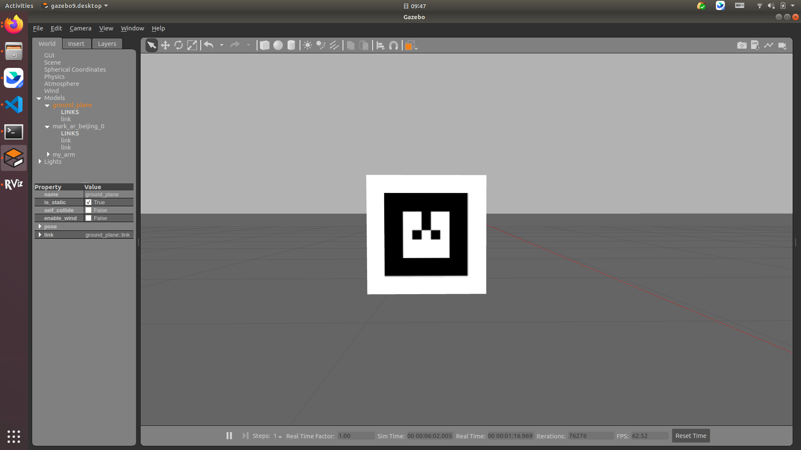
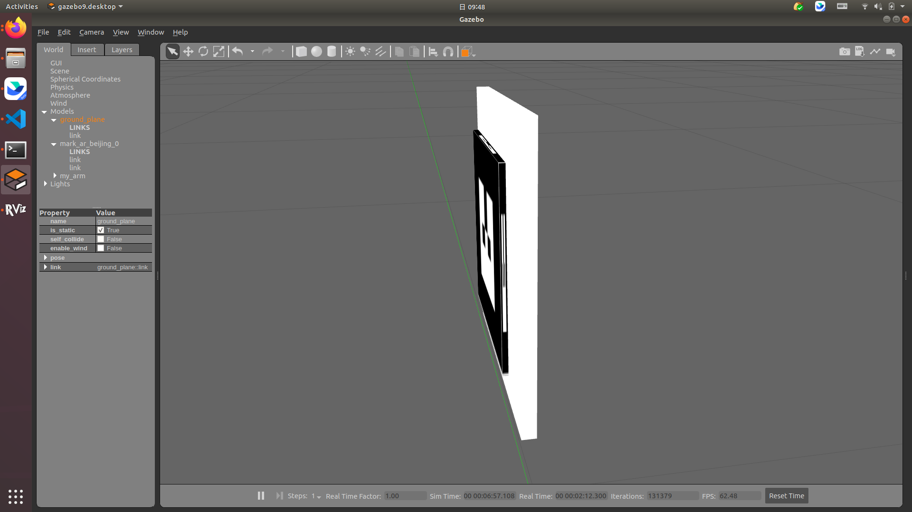
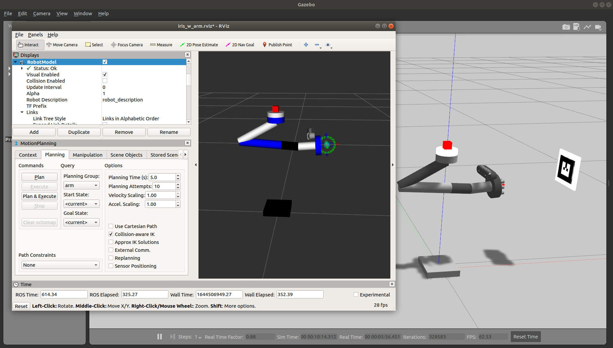
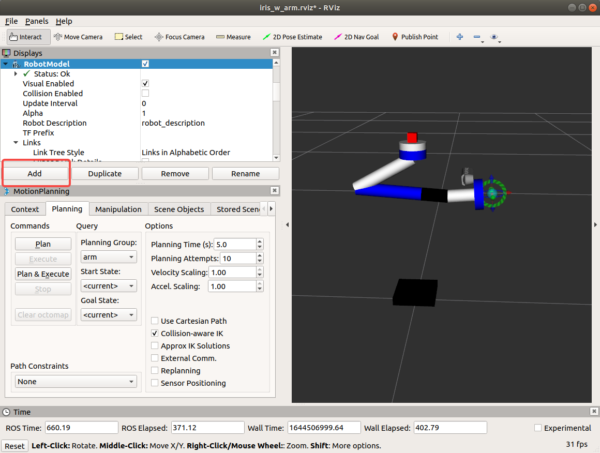
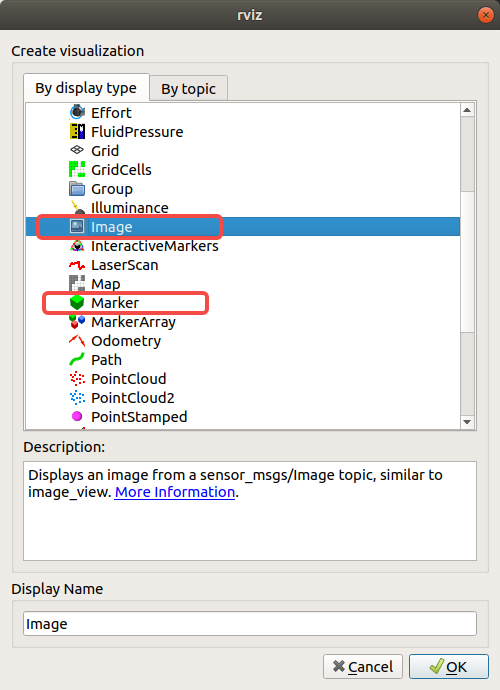
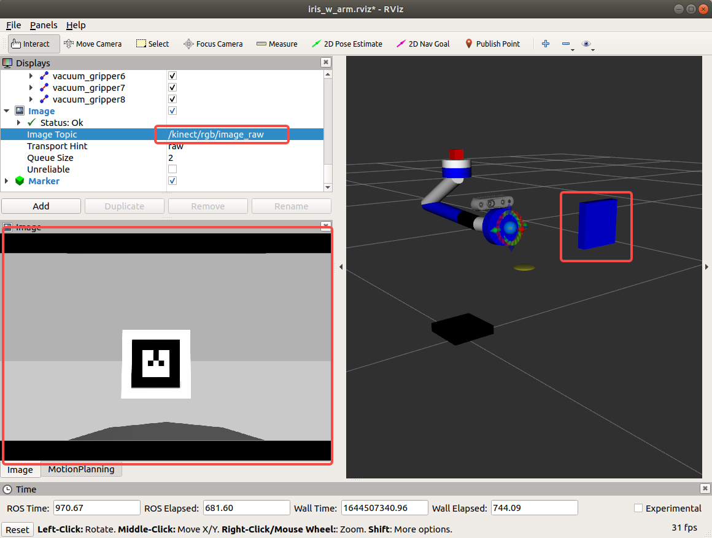
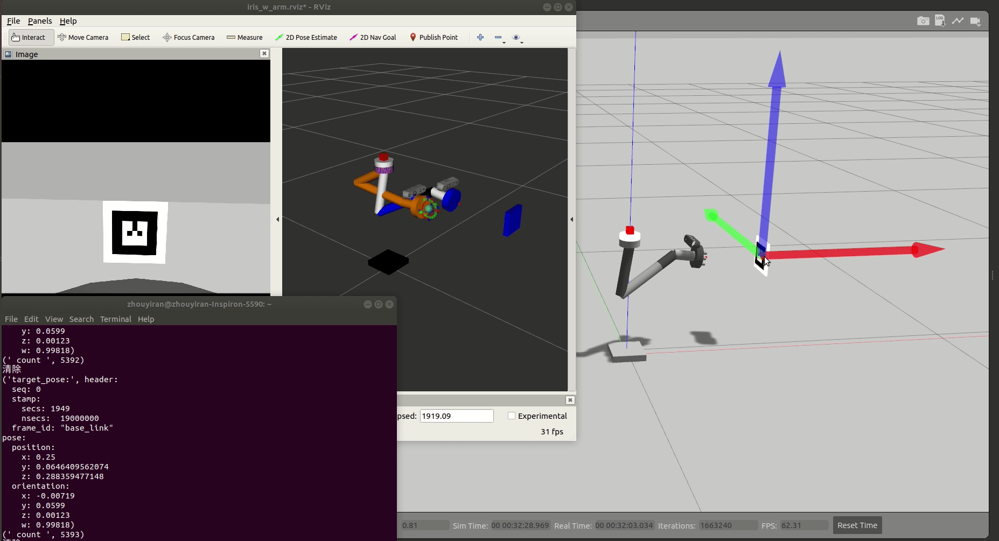

# 机械臂视觉

## 开始之前

本期介绍机械臂视觉的相关内容，即实现机械臂对二维码的识别与跟踪。

安装二维码识别相关ROS包以及动力学求解器，这里使用[ar_track_alvar](http://wiki.ros.org/ar_track_alvar)和[track_ik](http://wiki.ros.org/trac_ik)：

```
sudo apt install ros-melodic-ar-track-alvar
sudo apt install ros-melodic-trac-ik
```

开始之前，请更新ROS工作空间，可通过以下指令查看本期内容的所有相关文件：

```Shell
cd ~/AerialManipulator
git checkout phase3
```

确认ROS工作空间中的[mobot_urdf](../mobot_urdf/)目录是正确且完整的，确认ROS工作空间中包含[my_arm_moveit_config](../my_arm_moveit_config/)目录，无误后编译工作空间：

```Shell
cd ~/catkin_make
catkin_make
source devel/setup.bash
```

## 建模说明

### 机械臂模型

[上期](../docs/2.md)我们介绍了使用moveit实现机械臂建模与运动控制的过程，本期我们不再重复，相关模型文件与moveit配置文件均已发布，请自行查看。

除机械臂模型外，还有相机（位于机械臂末端）模型和各种传感器（如位于机械臂底座的力传感器）模型，细节可参考：

- [air_arm.xacro](../mobot_urdf/urdf/air_arm.xacro)
- [my_arm.xacro](../mobot_urdf/urdf/my_arm.xacro)

### 二维码模型

我们发布了一系列[二维码模型](../models/)便于复现，请先将相关文件添加到gazebo的模型目录下：

```Shell
cd ~/AerialManipulator/models
cp * ./.gazebo/models # 复制到正确的gazebo模型保存位置
```

需要注意的是，在gazebo中放置得到二维码并非平面，为了避免边缘二维码纹理的影响，我们在二维码模型后添加了白色背景板提高边缘对比度：





## 机械臂跟踪

执行：

```Shell
cd ~/catkin_ws/src/mobot_urdf/launch
roslaunch my_arm_bringup_moveit.launch
```

启动gazebo与rviz：



在rviz中添加`Marker`和`Image`，并`Image Topic`改为`kinect/rgb/image_raw`：







执行：

```Shell
roslaunch mobot_urdf ar_track_tracking.launch
```

运行跟踪脚本前需要先修改脚本文件的执行权限：

```Shell
cd ~/catkin_ws/src/mobot_urdf/scripts
chmod a+x ar_track.py
rosrun mobot_urdf ar_track.py
```

即可开始执行跟踪程序，效果如下：



## 写在最后

至此机械臂视觉实现介绍完毕，下期介绍机械臂末端执行器相关内容。本期文档内容以执行过程和效果执行效果为主，原理性的介绍可以观看我们录制的[视频](https://b23.tv/KJj3eRe)。

执行上述过程中遇到的任何问题可提交issue讨论。部分常见问题会包含在视频教程中供大家参考。